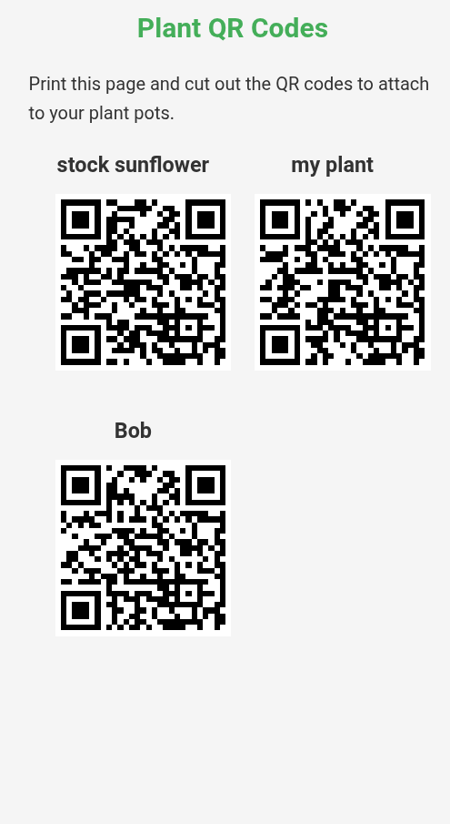

# Leaf
The name is short for "Log every aquatic feeding", it is a web application to help you keep track of your plants watering so that you don't forget to water them or water them too much. One way you can do this is by printing a qr code for each plant and sticking it on it's pot, this is useful if you have a lot of plants.




## Features

- Mobile-friendly design
- Track multiple plants with individual watering schedules
- Record watering dates and see days since last watering
- Upload image for each plant to help you identify it
- Beautiful and intuitive user interface
- QR code generation for easy plant identification
- Real-time updates and easy navigation

## Tech Stack

- **Backend**: Python with Flask
- **Frontend**: HTML, CSS
- **Data Storage**: JSON file-based storage
- **Additional Libraries**: 
  - qrcode for QR code generation
  - Werkzeug for secure file handling

## Prerequisites
Leaf is made in a way that i can host it localy on an old Android 5 phone with Tmux and Python 3.8.0

## Installation

1. Clone the repository:
```bash
git clone https://github.com/yourusername/plant-watering-tracker.git
cd plant-watering-tracker
```

2. Install the required dependencies:
```bash
pip install -r requirements.txt
```

3. Run the application:
```bash
python app.py
```

The application will be available on your local network
